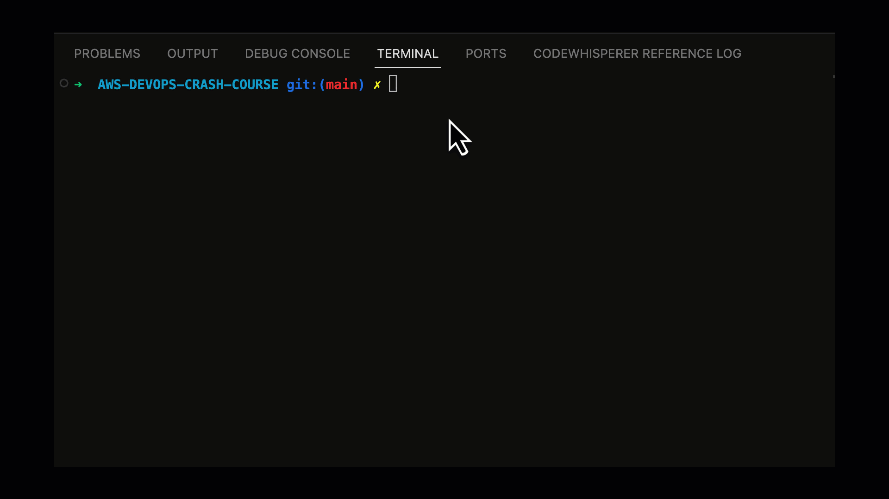

# Configure Git Client

## Method 1: HTTPS credential
1. From the IAM console select your user. 
2. From the user configuration page select `Security Credentials`.  Scroll to `HTTPS Git credentials for AWS CodeCommit`.
3. Click `Generate Credentials`.
4. Click `Download Credentials`.


## Method 2: SSH Key
1. From a commandline terminal run `ssh-keygen`.
2. Enter the filename `~/.ssh/codecommit`.
3. Leave the passphrase blank.
4. Copy the contents of `~/.ssh/codecommit.pub` to the clipboard.
5. From the IAM console select your user. 
6. From the user configuration page select `Security Credentials`.  Scroll to `SSH public keys for AWS CodeCommit`.
7. Click `Upload SSH Public Key`.
8. Paste the content of the file copied in step 4.
9. Click `Upload SSH Public Key`.
10. Edit `~/.ssh/config`. Create and entry for CodeCommit:
```
Host git-codecommit.*.amazonaws.com
User <ssh key id from IaM console>
IdentityFile ~/.ssh/codecommit
```


## Method 3: gRPC
1. Ensure that Python is installed and is in your PATH.
2.  Install git-remote-codecommit:
``` bash
pip3 install git-remote-codecommit
```

